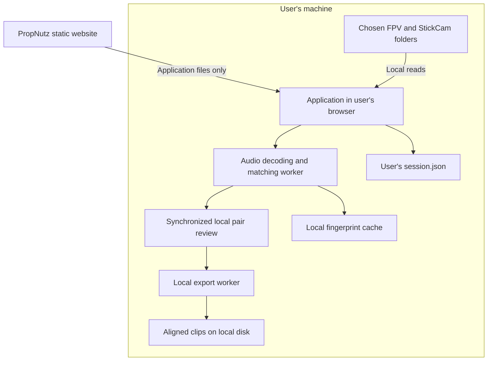

# Client-only PropNutz Flight Sync: feasibility and proposed fork

Investigated 7 October 2026 using the current code and primary browser/media documentation. This is a design recommendation, not a completed browser port or a measured performance result.

## Conclusion

**Yes: PropNutz can host the application while recordings, session JSON, fingerprints and exports remain on each user's machine.** The host would serve static HTML, JavaScript, fonts and optional WebAssembly. All media processing and storage would run in the user's browser. No account, video upload or session database is required for that model.

Saving JSON locally is the straightforward part. The substantial change is moving the Python/NumPy/SciPy/FFmpeg work to browser workers and native media APIs. HEVC playback and exact, full-resolution exports need a compatibility investigation before promising the complete workflow on every device.

Recommendation: keep this documented local release intact and build a **separate browser edition**, provisionally `propnutz-flight-sync-web`, from the `v0.1.0` baseline. Do not publish the existing Python server as a public multi-user service and assume its data is client-local.

## What the current project does

The following conclusions come directly from the checked-out code:

| Current component | Current location | Browser edition replacement |
|---|---|---|
| `web.py` folder browser / metadata scan | Python app server | Client folder picker and local file/container inspection |
| `store.py` session document | App server's `data/sessions/.../session.json` | User-selected JSON file with browser autosave/recovery |
| `fingerprint.py` and `evidence.py` | NumPy/SciPy plus FFmpeg on app server | Local audio demux/decode and fingerprint/matching worker |
| `.npz` fingerprints | App server's session directory | Local binary cache plus portable manifest |
| `matching.py` clock suggestions | Python app server | Browser code using the same offset/clock conventions |
| Original/fragment previews | Served/generated by app server | Local File/Blob playback, optionally a local decoder worker |
| `exports.py` | Native FFmpeg on app server | Streaming browser export or optional local desktop exporter |

The current LAN client stores only a selected session ID in `localStorage`; its session contents and processing are still on the app server. Moving only `session.json` would leave the rest of the workflow dependent on that server.

## Proposed data flow



There is no media/session upload route in this design. Ordinary requests to load the application can still appear in the host/CDN access logs; avoiding recording/session storage is a distinct promise from disabling all website request logs.

## Folder access and a real local JSON file

Use `showDirectoryPicker()` for each source folder and a separate writable project folder. These APIs require HTTPS and a user gesture; the browser grants access only to the selected files/folders. Initially target desktop Chrome and Edge. Firefox and Safari do not expose these native pickers in current compatibility data. Provide ordinary file/folder selection and JSON download/import as a fallback, with more manual reopening/saving. [MDN directory picker](https://developer.mozilla.org/en-US/docs/Web/API/Window/showDirectoryPicker), [MDN save picker](https://developer.mozilla.org/en-US/docs/Web/API/Window/showSaveFilePicker), [MDN compatibility data](https://github.com/mdn/browser-compat-data/blob/main/api/Window.json).

Store a normal `session.json` in the user-selected project folder and autosave through its writable handle. Remember handles in IndexedDB, check permissions on reopening, and request access again when needed. A handle stored through browser structured cloning is not a portable JSON path: importing a session on another machine must relink its videos. [Chrome File System Access guide](https://developer.chrome.com/docs/capabilities/web-apis/file-system-access).

Suggested on-disk project layout, with paths relative to the selected project folder:

```text
My flight session/
  session.json
  fingerprints/
    <source-and-algorithm-key>.bin
  exports/
    <pair>/FPV_aligned.mp4
    <pair>/StickCam_aligned.mp4
    <pair>/alignment.json
```

The sources remain wherever the user selected them; they are not copied into this folder. JSON should hold the session name, source identities, camera timestamps, durations, matches, evidence summaries, confirmations, clock anchors, extraction settings and cache references. Include a schema version and revision, and mark incomplete exports separately. Match relinked sources by role, relative name, size, modified time and a small sampled content signature; ask for a choice when identity is ambiguous.

Keep browser-only recovery data and disposable caches in IndexedDB/OPFS when available. OPFS is local to the browser origin and not a normal user-visible folder. Its contents can disappear when site data is cleared, and browser-managed data is quota-limited. Request persistent storage but keep the exported/user-folder JSON as the durable copy. Never duplicate every 4K source in browser storage. [MDN OPFS](https://developer.mozilla.org/en-US/docs/Web/API/File_System_API/Origin_private_file_system), [MDN storage quotas](https://developer.mozilla.org/en-US/docs/Web/API/Storage_API/Storage_quotas_and_eviction_criteria).

Two client machines have independent data by default. Users can copy a project folder/JSON and relink local recordings, or use their own shared storage. There is no automatic PropNutz-hosted synchronization. Concurrent edits to the same JSON need a conflict/revision check before overwriting it.

## Audio extraction and matching

Read camera containers from a local File/Blob, inspect tracks, then seek to the first/last sampled intervals. Decode only audio, even when the video track is HEVC and cannot be played by that browser. Mediabunny is a candidate for local container inspection; it documents Blob-backed input, track discovery, duration and bounded input caching. Support the camera formats we actually need first. [Mediabunny reading guide](https://mediabunny.dev/guide/reading-media-files).

Use WebCodecs `AudioDecoder` in a worker where supported, downmix/resample to the existing 8 kHz fingerprint input, and port spectral landmarks, normalized trends and same-offset section checks. WebCodecs supplies codecs, not container parsing. Decoder/encoder support is specific to the actual track configuration, so detect it at runtime and report unsupported tracks. [MDN WebCodecs](https://developer.mozilla.org/en-US/docs/Web/API/WebCodecs_API).

Do not read a complete multi-gigabyte video into an ArrayBuffer simply to use `decodeAudioData()`: that API expects complete file data, not arbitrary fragments. A demuxer plus chunked decoding is the appropriate design for boundary sampling. The browser's File object also exposes modification time for the existing clock logic. [MDN decodeAudioData](https://developer.mozilla.org/en-US/docs/Web/API/BaseAudioContext/decodeAudioData), [MDN File.lastModified](https://developer.mozilla.org/en-US/docs/Web/API/File/lastModified).

Inference from those APIs: the audio-only workload should be practical on suitable desktops because video frames need not be decoded for matching. Actual speed, memory use and parity with the Python matcher remain to be measured on real recordings. Begin with one active extraction worker and reuse persisted fingerprints.

## Preview and exact aligned exports

Play supported sources using local Blob URLs. Where native video playback cannot handle a track, a browser-side decoder may produce low-resolution previews, but it cannot create a missing HEVC decoder automatically. Capability checks must distinguish audio matching, video playback and export support. Matching a recording's AAC audio does not prove that its HEVC video is exportable.

For compatible tracks, decode the overlapping interval and encode a common output frame rate with explicit timestamps, equal frame counts, common trim endpoints and zero-based output times. Stream each output to a user-approved local writable file rather than assembling a full 4K output in RAM. Mediabunny documents output streaming/backpressure and direct File System writable targets. Browser export should initially target H.264 MP4 and explicitly report unsupported configurations. [Mediabunny writing guide](https://mediabunny.dev/guide/writing-media-files), [Mediabunny codec support](https://mediabunny.dev/guide/supported-formats-and-codecs).

Fast compressed-video copying can be offered only with clear keyframe constraints. Arbitrary source cuts cannot generally be copied without either retaining an earlier keyframe/dependencies or re-encoding; independently snapping each feed to a different keyframe would break the reviewed alignment. A fast mode must expose its effective common interval, not silently alter the offset. Preserving the current equal-frame export guarantee is a separate requirement from merely writing a playable MP4.

Do not make full-file FFmpeg.wasm transcoding the default for this workload. Its own FAQ documents a 2 GB input limit and slower performance than native FFmpeg; that is a poor baseline for batches of large camera recordings. These are project-documented limits, not a universal statement about every possible WebAssembly implementation. A small optional audio fallback can be investigated independently. [FFmpeg.wasm FAQ](https://github.com/ffmpegwasm/ffmpeg.wasm/blob/main/apps/website/docs/faq.md).

For unsupported HEVC/10-bit material, DNxHR, or very large editing exports, an optional **local companion exporter** remains a practical fallback. It could read the local alignment JSON and run native FFmpeg, without uploading media. Prefer a downloadable desktop companion or explicit local CLI job over allowing any public webpage to control an unrestricted localhost file browser. The browser-only path should still work without that companion for its supported formats.

## Publishing on PropNutz

Proposed location: a dedicated HTTPS origin such as `sync.propnutz.co.uk`, linked from the main website. This isolates the application's browser storage and permits its own worker/CSP settings; it is a proposal, not a configured domain.

- Serve only versioned application assets, with all fonts/libraries bundled locally.
- Run matching, preview conversion and export locally; do not add media/session upload endpoints.
- Exclude filenames, fingerprints, paths and JSON contents from URLs, analytics, crash reporting and remote logs.
- Put any normal marketing embeds/analytics outside the processing app.
- Add an offline PWA app-shell cache after the core workflow works. Installing a PWA does not supply extra codec support or ordinary filesystem privileges.
- If a future multithreaded WASM fallback needs SharedArrayBuffer, configure the required cross-origin isolation on the dedicated app origin; do not assume those headers already exist on the main site.

## Implementation gates for the separate fork

1. **Storage and compatibility shell:** client folder pickers, capability panel, real JSON save/open, relinking and recovery. No Python endpoints.
2. **Local audio proof:** read one FPV/StickCam pair, decode sampled audio, port the matcher and compare its offsets/evidence with the saved local baseline. Include unequal lengths and unrelated recordings.
3. **Full matching workflow:** batch/subset processing, saved fingerprints, cancellation/progress, clock suggestions, one-to-many FPV parts and confirmations.
4. **Pair review:** local playback, manual adjustments, matching audio sections, explicit unsupported-codec behavior.
5. **Export proof:** stream a full-resolution pair to disk with equal frame counts; verify common start/end, audio timing, cancellation and source changes. Cover H.264 and actual DJI HEVC/10-bit profiles, including files over 4 GB.
6. **Release readiness:** exercise 10–40 pairs on representative desktop browsers, permission revocation, cache eviction, JSON import on a second machine and operation with the network disconnected after app loading. Audit requests to establish that no recording/session payload leaves the device.

If exact exports fail the target-browser gate, ship the browser matcher/reviewer with an explicit local-export fallback, or retain the desktop edition for the full workflow. Do not claim universal no-install exports before these gates pass.

## Preservation

The current repository remains the local-server edition. `snapshot-2026-10-07` preserves the pre-documentation source, and `v0.1.0` preserves the documented release. This report changes documentation only; a browser fork has not been implemented or deployed.
